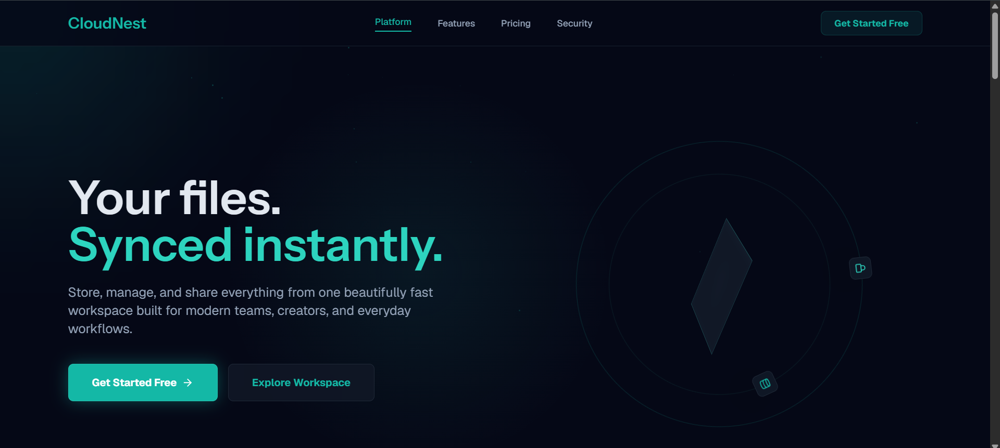
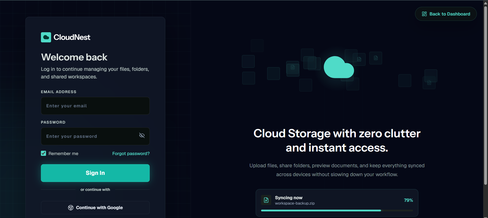
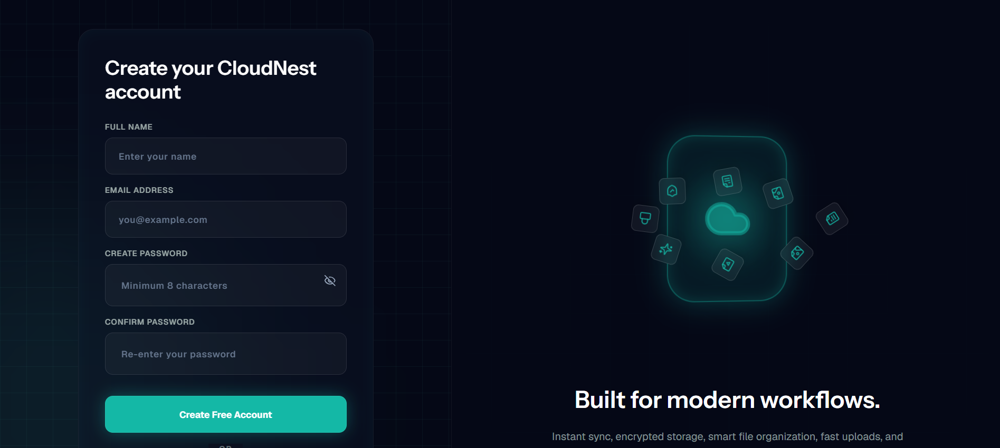
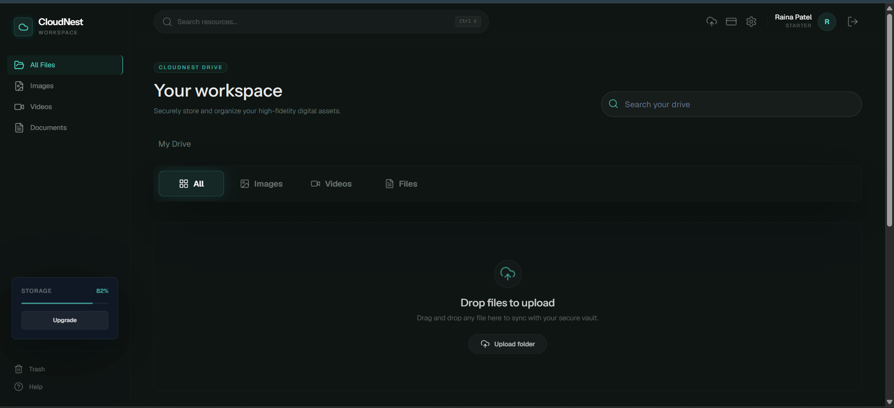
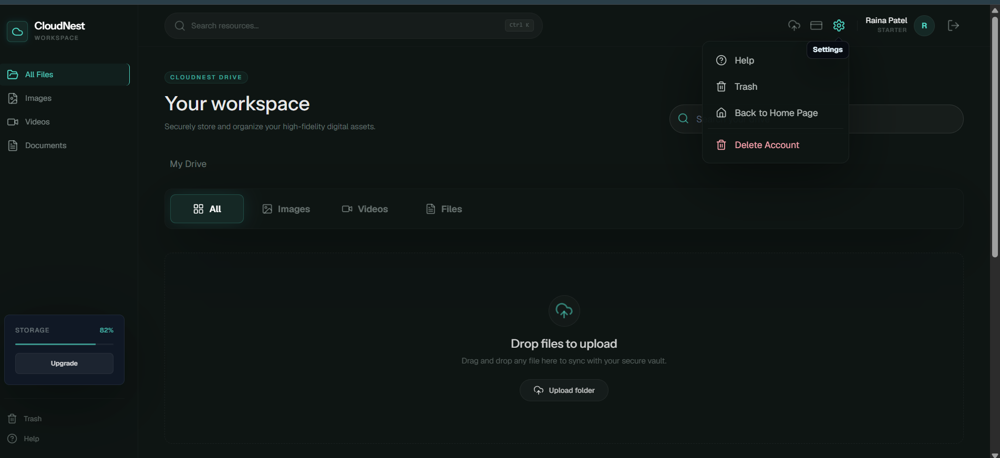
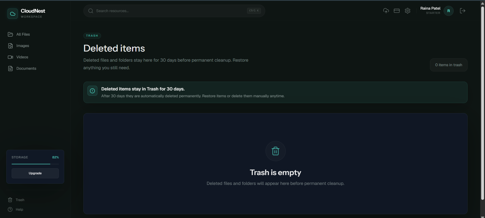
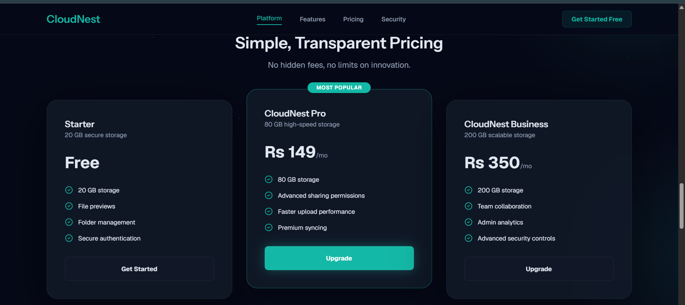
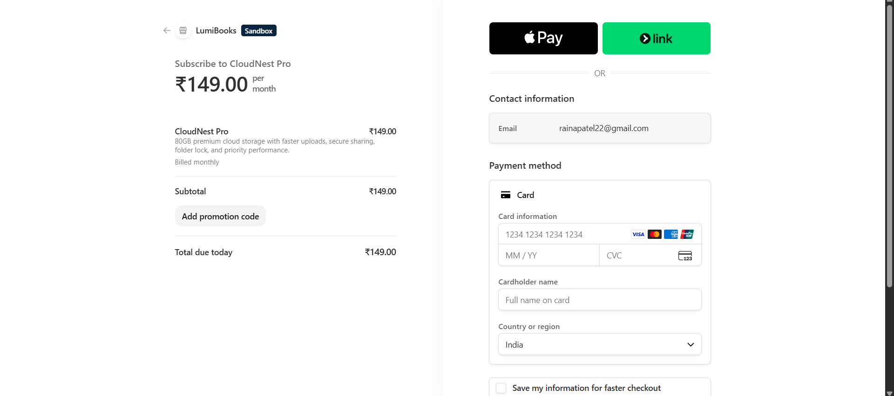
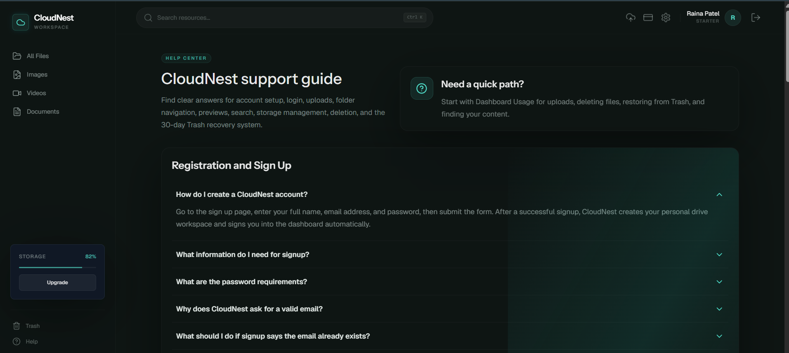
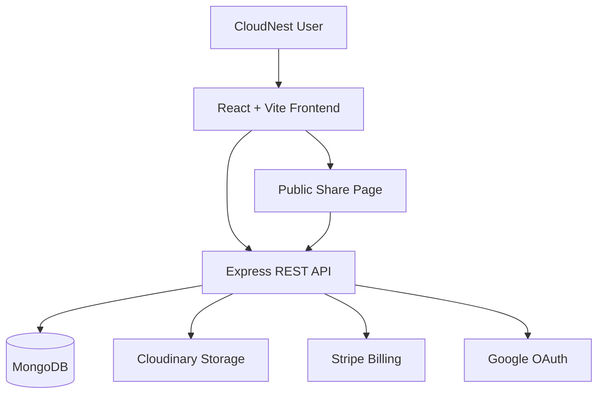

<div align="center">

# ☁️ CloudNest

### Your files. Securely stored. Instantly accessible.

A production-ready cloud storage SaaS platform inspired by Google Drive, featuring secure authentication, file and folder management, cloud uploads, previews, public sharing, recoverable trash, storage quotas, and Stripe-powered subscription plans.

[](https://cloudnest-liart.vercel.app)
[](https://github.com/Shrushti2003)
[](https://www.linkedin.com/in/shrushti-swarnakar/)

<br />


</div>

---

## 📖 About CloudNest

**CloudNest** is a full-stack cloud storage SaaS application that allows users to securely upload, organize, preview, share, download, and manage their files from a modern web-based workspace.

The application combines an interactive React interface with a structured Express API, MongoDB persistence, Cloudinary file storage, JWT authentication, Google OAuth, storage quota enforcement, and Stripe subscription billing.

CloudNest goes beyond basic file uploading by providing folder organization, intelligent search, multiple preview formats, starred files, recoverable trash, public sharing links, activity tracking, subscription-based storage limits, and a command palette for faster navigation.

> CloudNest demonstrates how a production-oriented SaaS application can combine cloud storage, authentication, billing, security, and responsive design in one scalable system.

### 🔗 Quick Links

- **Live Application:** [cloudnest-liart.vercel.app](https://cloudnest-liart.vercel.app)
- **GitHub Profile:** [github.com/Shrushti2003](https://github.com/Shrushti2003)
- **LinkedIn:** [linkedin.com/in/shrushti-swarnakar](https://www.linkedin.com/in/shrushti-swarnakar/)
- **LeetCode:** [leetcode.com/u/Shrushti2003](https://leetcode.com/u/Shrushti2003/)

---

## ✨ Key Features

### 🔐 Authentication and Account Security

- Email and password registration.
- Secure user login and logout.
- Google OAuth authentication.
- Short-lived JWT access tokens.
- HttpOnly refresh-token cookies.
- Automatic session restoration.
- Forgot-password and reset-password flows.
- Protected application routes.
- Email-verification endpoint.
- Permanent account-deletion flow.

### 📤 File Upload and Storage

- Drag-and-drop file uploading.
- Upload multiple files in a single operation.
- Maximum of 25 files per upload request.
- File-size limit of 250 MB per file.
- Cloudinary-backed production storage.
- Local development fallback when Cloudinary is unavailable.
- Automatic file-type and category detection.
- Storage usage and quota calculation.
- Security-based blocking of executable file types.

### 📂 File and Folder Management

- Create and organize folders.
- Open nested folder workspaces.
- Rename files and folders.
- Move files between folders.
- Copy files.
- Star and unstar important files.
- Search files by name, extension, type, category, or tag.
- Filter files by category.
- Download stored files through secure backend endpoints.
- Grid and workspace-oriented file presentation.

### 👁️ File Preview System

CloudNest provides browser-based previews for supported formats:

- Images
- Videos
- Audio files
- PDF documents
- Text files
- Browser-supported media

Office documents and unsupported formats remain securely stored and can still be downloaded, renamed, copied, shared, or deleted.

### 🔗 Public File Sharing

- Generate public sharing links.
- Resolve shared files through unique tokens.
- Enable downloadable public links.
- View previously created shares.
- Revoke shared links.
- Access public shares without requiring account authentication.

### 🗑️ Recoverable Trash

- Move files and folders to Trash instead of immediately deleting them.
- Restore deleted files and folders.
- Preserve deleted items for up to 30 days.
- Permanently delete files when required.
- Release used storage after permanent deletion.
- Confirmation protection for irreversible deletion.

### 💳 Subscription and Billing

- Stripe Checkout integration.
- Stripe customer billing portal.
- Webhook-based subscription synchronization.
- Payment success and cancellation pages.
- Subscription-aware storage limits.
- Starter, Pro, and Business plans.
- Local development billing fallback.

### 🎨 User Experience

- Responsive interface for desktop, tablet, and mobile.
- Modern dark visual theme.
- Smooth Framer Motion and GSAP animations.
- Ambient background and cursor effects.
- Keyboard-friendly command palette.
- Toast notifications for user actions.
- Loading skeletons and empty states.
- Dedicated support center.
- Protected route redirection.
- Optimized server-state caching with TanStack Query.

---

## 🖼️ Application Screenshots

### Landing Page

<p align="center">
  
</p>

### Home Experience

<p align="center">
  
</p>

### Authentication

<table>
  <tr>
    <td align="center"><strong>Sign In</strong></td>
    <td align="center"><strong>Sign Up</strong></td>
  </tr>
  <tr>
    <td width="50%">
      
    </td>
    <td width="50%">
      
    </td>
  </tr>
</table>

### Dashboard

<p align="center">
  
</p>

### File Management

<p align="center">
  
</p>

### Trash Recovery

<p align="center">
  
</p>

### Subscription Plans

<p align="center">
  
</p>

### Stripe Payment

<p align="center">
  
</p>

### Support Center

<p align="center">
  
</p>

---

## 💳 Storage Plans

| Plan | Monthly Price | Storage | Highlights |
|---|---:|---:|---|
| **Starter** | Free | 20 GB | Secure storage, file previews and folder management |
| **CloudNest Pro** | ₹149/month | 80 GB | Advanced sharing controls and priority uploads |
| **CloudNest Business** | ₹350/month | 200 GB | Workspace storage, admin analytics and team-ready controls |

> Paid plans are processed through Stripe when Stripe credentials and price identifiers are configured.

---

## 🛠️ Technology Stack

### Frontend

| Technology | Purpose |
|---|---|
| **React 18** | Component-based user interface |
| **Vite** | Fast development server and production bundling |
| **React Router** | Client-side routing and protected navigation |
| **Tailwind CSS** | Responsive utility-first styling |
| **TanStack Query** | Server-state fetching, synchronization and caching |
| **Zustand** | Lightweight authentication and UI state management |
| **Axios** | HTTP requests and authentication interceptors |
| **React Dropzone** | Drag-and-drop file uploads |
| **Framer Motion** | Component and page animations |
| **GSAP** | Advanced landing-page animations |
| **Lenis** | Smooth scrolling |
| **Stripe.js** | Subscription checkout integration |
| **Google OAuth** | Google account authentication |
| **React Hot Toast** | User feedback notifications |
| **Lucide React** | Application icon system |

### Backend

| Technology | Purpose |
|---|---|
| **Node.js** | JavaScript server runtime |
| **Express.js** | REST API framework |
| **MongoDB** | Application database |
| **Mongoose** | MongoDB schema and model management |
| **Cloudinary** | Cloud file storage and delivery |
| **Multer** | Multipart file-upload processing |
| **Stripe** | Subscription payments and billing |
| **JSON Web Tokens** | Access and refresh token authentication |
| **Google Auth Library** | Server-side Google credential verification |
| **bcrypt.js** | Password hashing |
| **Zod** | Request validation |
| **Helmet** | HTTP response security headers |
| **Express Rate Limit** | API and authentication rate limiting |
| **Mongo Sanitize** | NoSQL injection protection |
| **HPP** | HTTP parameter pollution protection |
| **Morgan** | HTTP request logging |
| **Compression** | Response compression |
| **Supertest** | Backend integration testing |

### Deployment and Development

| Tool | Purpose |
|---|---|
| **Vercel** | Frontend hosting and SPA rewrites |
| **Render** | Backend API deployment |
| **MongoDB Atlas** | Production database hosting |
| **Git and GitHub** | Source control and collaboration |
| **ESLint** | Code-quality validation |
| **Nodemon** | Automatic backend development reload |

---

## 🏗️ System Architecture



### Request Flow

1. The user interacts with the React frontend.
2. TanStack Query and Axios communicate with the Express REST API.
3. Protected requests carry a short-lived JWT access token.
4. Expired sessions can be restored using a secure refresh-token cookie.
5. MongoDB stores users, file metadata, folders, shares, subscriptions, and activity records.
6. Cloudinary stores uploaded file content in production.
7. Stripe processes subscription upgrades and billing events.
8. Public share tokens allow controlled file access without exposing private application routes.

---

## 📁 Project Structure

```text
Google-Drive-Clone/
├── backend/
│   ├── src/
│   │   ├── config/             # Database, CORS, Cloudinary, Stripe and environment setup
│   │   ├── controllers/        # Authentication, files, folders, sharing and billing logic
│   │   ├── middlewares/        # Authentication, uploads, validation and security
│   │   ├── models/             # MongoDB application models
│   │   ├── routes/             # REST API route definitions
│   │   ├── scripts/            # Smoke tests, integrations and repair utilities
│   │   ├── services/           # Storage, quota, trash and activity services
│   │   ├── shared/             # Plans, file types and shared utilities
│   │   ├── utils/              # Errors, tokens, cookies and validators
│   │   ├── app.js              # Express application configuration
│   │   └── index.js            # Backend server entry point
│   ├── package.json
│   └── package-lock.json
│
├── frontend/
│   ├── src/
│   │   ├── components/         # Authentication, files, previews and UI components
│   │   ├── config/             # Query client and subscription configuration
│   │   ├── context/            # Theme context
│   │   ├── layouts/            # Application, authentication and command-palette layouts
│   │   ├── pages/              # Landing, drive, billing, trash and support pages
│   │   ├── services/           # API and OAuth services
│   │   ├── store/              # Zustand state stores
│   │   ├── styles/             # Global styling
│   │   ├── utils/              # File, formatting and date utilities
│   │   ├── main.jsx            # Frontend entry point
│   │   └── router.jsx          # Application routes
│   ├── vercel.json
│   ├── vite.config.js
│   └── package.json
│
├── screenshots/                # README application screenshots
├── .env.example                # Environment-variable template
├── render.yaml                 # Render deployment blueprint
├── package.json                # Root development scripts
└── README.md
```

---

## 🚀 Getting Started

### Prerequisites

Before running CloudNest locally, install:

- [Node.js](https://nodejs.org/) version 18.18 or later
- [npm](https://www.npmjs.com/)
- [Git](https://git-scm.com/)
- [MongoDB](https://www.mongodb.com/) locally or through MongoDB Atlas
- A Cloudinary account for real cloud uploads
- A Google Cloud OAuth client for Google authentication
- A Stripe account for subscription payments

### 1. Clone the Repository

```bash
git clone https://github.com/Shrushti2003/Google-Drive-Clone.git
cd Google-Drive-Clone
```

### 2. Install All Dependencies

```bash
npm run install:all
```

This command installs the root, frontend, and backend dependencies.

### 3. Create Environment Files

#### Git Bash, macOS or Linux

```bash
cp .env.example .env
cp frontend/.env.example frontend/.env
```

#### Windows Command Prompt

```cmd
copy .env.example .env
copy frontend\.env.example frontend\.env
```

### 4. Configure Backend Environment Variables

Add the following values to the root `.env` file:

```env
# Application
NODE_ENV=development
PORT=8080
CLIENT_URL=http://localhost:5173
SERVER_URL=http://localhost:8080

# MongoDB
MONGODB_URI=mongodb://127.0.0.1:27017/cloudnest-drive
MONGODB_FALLBACK_URI=mongodb://127.0.0.1:27017/cloudnest-drive
MONGODB_SERVER_SELECTION_TIMEOUT_MS=5000
DATABASE_REQUIRED=false

# Authentication
JWT_ACCESS_SECRET=replace-with-a-long-random-access-secret
JWT_REFRESH_SECRET=replace-with-a-long-random-refresh-secret
ACCESS_TOKEN_TTL=15m
REFRESH_TOKEN_TTL=30d
COOKIE_SECRET=replace-with-a-long-random-cookie-secret

# Google OAuth
GOOGLE_CLIENT_ID=your-google-client-id
GOOGLE_CLIENT_SECRET=your-google-client-secret
GOOGLE_OAUTH_CALLBACK_URL=http://localhost:8080/api/auth/google/callback

# Cloudinary
CLOUDINARY_CLOUD_NAME=your-cloud-name
CLOUDINARY_API_KEY=your-cloudinary-api-key
CLOUDINARY_API_SECRET=your-cloudinary-api-secret
CLOUDINARY_UPLOAD_FOLDER=cloudnest
CLOUDINARY_DIRECT_UPLOAD=false
CLOUDINARY_REQUIRED=false

# Stripe
STRIPE_SECRET_KEY=your-stripe-secret-key
STRIPE_WEBHOOK_SECRET=your-stripe-webhook-secret
STRIPE_PRO_PRICE_ID=your-stripe-pro-price-id
STRIPE_BUSINESS_PRICE_ID=your-stripe-business-price-id
```

### 5. Configure the Frontend

Add this value to `frontend/.env`:

```env
VITE_API_URL=http://localhost:8080/api
```

### 6. Start the Application

Start the frontend and backend together:

```bash
npm run dev
```

The application will run at:

| Service | URL |
|---|---|
| Frontend | [http://localhost:5173](http://localhost:5173) |
| Backend | [http://localhost:8080](http://localhost:8080) |
| REST API | [http://localhost:8080/api](http://localhost:8080/api) |
| Health Check | [http://localhost:8080/health](http://localhost:8080/health) |

---

## 📜 Available Scripts

Run these commands from the project root:

| Command | Description |
|---|---|
| `npm run install:all` | Installs root, frontend and backend dependencies |
| `npm run dev` | Runs the frontend and backend concurrently |
| `npm run dev:frontend` | Starts only the Vite frontend |
| `npm run dev:backend` | Starts only the Express backend |
| `npm run build` | Creates the frontend production build |
| `npm start` | Starts the production backend server |
| `npm run lint` | Lints the frontend and backend |
| `npm run smoke` | Runs backend smoke checks |
| `npm run integration` | Runs backend integration checks |

Additional backend utility:

```bash
npm --prefix backend run repair:files
```

This checks and repairs stored file-category information.

---

## 🔌 API Reference

All API endpoints use the `/api` prefix.

### Authentication

| Method | Endpoint | Access | Description |
|---|---|---|---|
| `POST` | `/auth/register` | Public | Creates a new account |
| `POST` | `/auth/login` | Public | Authenticates a user |
| `POST` | `/auth/refresh` | Cookie | Refreshes the access token |
| `POST` | `/auth/logout` | Public | Ends the refresh session |
| `GET` | `/auth/me` | Protected | Returns the authenticated user |
| `DELETE` | `/auth/me` | Protected | Permanently deletes the account |
| `POST` | `/auth/verify-email` | Protected | Verifies the account email |
| `POST` | `/auth/forgot-password` | Public | Starts password recovery |
| `POST` | `/auth/reset-password` | Public | Resets the user password |
| `GET` | `/auth/google/status` | Public | Returns Google OAuth availability |
| `GET` | `/auth/google` | Public | Starts Google OAuth |
| `GET` | `/auth/google/callback` | Public | Handles the OAuth callback |
| `POST` | `/auth/google/credential` | Public | Verifies a Google credential |

### Files

| Method | Endpoint | Access | Description |
|---|---|---|---|
| `GET` | `/files` | Protected | Lists files with filters and search |
| `POST` | `/files/upload` | Protected | Uploads up to 25 files |
| `PATCH` | `/files/:id` | Protected | Renames, moves or stars a file |
| `POST` | `/files/:id/copy` | Protected | Copies a file |
| `POST` | `/files/:id/trash` | Protected | Moves a file to Trash |
| `POST` | `/files/:id/restore` | Protected | Restores a trashed file |
| `DELETE` | `/files/:id` | Protected | Permanently deletes a file |
| `GET` | `/files/:id/download` | Protected | Retrieves a file download URL |
| `GET` | `/files/:id/preview` | Protected | Retrieves file preview content |

### Folders

| Method | Endpoint | Access | Description |
|---|---|---|---|
| `GET` | `/folders` | Protected | Lists user folders |
| `POST` | `/folders` | Protected | Creates a folder |
| `PATCH` | `/folders/:id` | Protected | Updates a folder |
| `POST` | `/folders/:id/trash` | Protected | Moves a folder to Trash |
| `POST` | `/folders/:id/restore` | Protected | Restores a folder |
| `DELETE` | `/folders/:id` | Protected | Permanently deletes a folder |

### Public Sharing

| Method | Endpoint | Access | Description |
|---|---|---|---|
| `GET` | `/shares/public/:token` | Public | Resolves a public share link |
| `GET` | `/shares` | Protected | Lists the user's shared links |
| `POST` | `/shares` | Protected | Creates a share link |
| `DELETE` | `/shares/:id` | Protected | Revokes a share link |

### Billing

| Method | Endpoint | Access | Description |
|---|---|---|---|
| `GET` | `/billing/subscription` | Protected | Returns subscription details |
| `POST` | `/billing/checkout` | Protected | Creates a Stripe Checkout session |
| `POST` | `/billing/checkout/sync` | Protected | Synchronizes checkout results |
| `POST` | `/billing/portal` | Protected | Opens the Stripe billing portal |
| `POST` | `/billing/webhook` | Stripe | Processes Stripe webhook events |

### Dashboard and Administration

| Method | Endpoint | Access | Description |
|---|---|---|---|
| `GET` | `/dashboard` | Protected | Returns user dashboard data |
| `GET` | `/dashboard/admin` | Admin | Returns administrative analytics |
| `GET` | `/dashboard/admin/users` | Admin | Returns administrative user data |

---

## 🛡️ Security Practices

CloudNest includes several security-focused implementation details:

- Password hashing with bcrypt.
- Short-lived JWT access tokens.
- HttpOnly refresh-token cookies.
- Separate access-token and refresh-token secrets.
- Protected API middleware.
- Role-based administrative route protection.
- Authentication-specific rate limiting.
- General API rate limiting.
- HTTP security headers through Helmet.
- NoSQL injection protection through Mongo Sanitize.
- HTTP parameter pollution protection through HPP.
- Restricted CORS configuration with credentials.
- Zod-based request validation.
- Blocked executable upload extensions.
- File-size and upload-count limits.
- Environment-based secrets.
- Stripe webhook verification.
- Confirmation before destructive actions.

> Never commit `.env` files, private keys, database credentials, or payment-provider secrets.

---

## 🚫 Blocked Upload Types

For security reasons, CloudNest rejects potentially executable file extensions such as:

```text
.exe  .bat  .cmd  .com  .msi  .scr
.ps1  .vbs  .js   .jar  .sh
```

Other file types can be stored subject to upload limits, although inline preview availability depends on the browser and file format.

---

## 🧪 Testing and Quality Checks

Run the following commands before submitting changes:

```bash
npm run lint
npm run build
npm run smoke
npm run integration
```

Optional dependency audits:

```bash
npm --prefix frontend audit --audit-level=moderate
npm --prefix backend audit --audit-level=moderate
```

These commands verify:

- Frontend and backend code quality.
- Production frontend compilation.
- Backend health and basic API availability.
- Authentication, file, folder, sharing and integration behaviour.
- Dependency vulnerability information.

---

## 🚀 Deployment

### Frontend Deployment on Vercel

Use the following Vercel configuration:

| Setting | Value |
|---|---|
| Root directory | `frontend` |
| Build command | `npm run build` |
| Output directory | `dist` |

Set the production environment variable:

```env
VITE_API_URL=https://your-backend-domain.com/api
```

The included `vercel.json` redirects frontend routes to the React application, allowing React Router pages to work after refreshing.

### Backend Deployment on Render

The repository includes a `render.yaml` deployment blueprint.

Required production values include:

```env
NODE_ENV=production
CLIENT_URL=https://your-frontend-domain.com
SERVER_URL=https://your-backend-domain.com

MONGODB_URI=your-production-mongodb-uri

JWT_ACCESS_SECRET=your-secure-access-secret
JWT_REFRESH_SECRET=your-secure-refresh-secret
COOKIE_SECRET=your-secure-cookie-secret

GOOGLE_CLIENT_ID=your-google-client-id
GOOGLE_CLIENT_SECRET=your-google-client-secret
GOOGLE_OAUTH_CALLBACK_URL=https://your-backend-domain.com/api/auth/google/callback

CLOUDINARY_CLOUD_NAME=your-cloud-name
CLOUDINARY_API_KEY=your-api-key
CLOUDINARY_API_SECRET=your-api-secret
CLOUDINARY_REQUIRED=true

STRIPE_SECRET_KEY=your-stripe-secret-key
STRIPE_WEBHOOK_SECRET=your-webhook-secret
STRIPE_PRO_PRICE_ID=your-pro-price-id
STRIPE_BUSINESS_PRICE_ID=your-business-price-id
```

Remember to add the production Google callback URL to the authorized redirect URIs in Google Cloud Console.

---

## 🚧 Challenges Faced and Solutions

### 1. Secure Session Management

**Challenge:** Access tokens need to remain short-lived for security, but repeatedly asking users to log in would create a poor experience.

**Solution:** CloudNest uses short-lived JWT access tokens with longer-lived HttpOnly refresh cookies. The frontend can restore an authenticated session without exposing the refresh token to client-side JavaScript.

### 2. Managing Cloud Uploads and File Metadata

**Challenge:** Uploaded file content and application metadata must remain synchronized even though they are stored by different systems.

**Solution:** Cloudinary manages the physical file content while MongoDB stores ownership, file type, size, folder, sharing, starring, trash, and storage-provider information.

### 3. Supporting Different File Formats

**Challenge:** Images, videos, audio, PDFs, documents, and archives require different preview and handling strategies.

**Solution:** The backend detects detailed file types using MIME types and extensions. The frontend selects the correct preview experience and provides downloads for formats that cannot be rendered safely in the browser.

### 4. Enforcing Storage Quotas

**Challenge:** Users must not be allowed to exceed the storage assigned to their subscription plan.

**Solution:** A quota service calculates used storage, compares new uploads against the active plan limit, and updates usage when files are uploaded or permanently deleted.

### 5. Designing Safe File Deletion

**Challenge:** Immediately deleting files could cause accidental and irreversible data loss.

**Solution:** Normal deletion moves items to a recoverable Trash area. Users can restore items or permanently delete them after confirmation, while expired items can be cleaned up after 30 days.

### 6. Integrating Subscription Payments

**Challenge:** The application must keep its internal subscription state consistent with Stripe Checkout and webhook events.

**Solution:** CloudNest creates Stripe Checkout sessions, processes verified webhook events, and includes a post-checkout synchronization endpoint to update the user’s plan and storage limit.

### 7. Handling Authentication Across Deployments

**Challenge:** Cross-origin cookies and OAuth callbacks behave differently between local development and HTTPS production deployments.

**Solution:** Environment-specific client, server, CORS, cookie, and OAuth callback configuration keeps authentication consistent across development, Vercel, and Render.

### 8. Protecting File Upload Endpoints

**Challenge:** File-upload endpoints can be abused through oversized uploads, excessive file counts, or executable files.

**Solution:** Multer limits individual files to 250 MB and each request to 25 files. Potentially executable extensions are explicitly rejected before storage processing.

---

## 🎓 Key Learnings

Building CloudNest strengthened my understanding of:

- Designing a production-oriented full-stack SaaS application.
- Structuring an Express backend using routes, controllers, services, middleware, and models.
- Implementing access-token and refresh-token authentication.
- Safely handling HttpOnly cookies across frontend and backend deployments.
- Integrating Google OAuth with an existing authentication system.
- Processing multipart file uploads with Multer.
- Separating physical cloud storage from database metadata.
- Designing file and folder relationships with MongoDB and Mongoose.
- Detecting and categorizing files through MIME types and extensions.
- Building multi-format file previews.
- Implementing recoverable deletion and permanent cleanup.
- Generating token-based public sharing links.
- Calculating and enforcing subscription-based storage quotas.
- Integrating Stripe Checkout, webhooks, and billing portals.
- Protecting APIs from injection, abuse, and malformed requests.
- Managing server state with TanStack Query.
- Managing client state efficiently with Zustand.
- Deploying separate frontend and backend services.
- Writing smoke and integration checks for backend behaviour.

---

## 🔮 Future Improvements

Potential future enhancements include:

- [ ] Add real-time collaborative folders.
- [ ] Support role-based team workspaces.
- [ ] Add granular share permissions such as view, comment and edit.
- [ ] Allow public links to expire automatically.
- [ ] Add optional passwords to shared links.
- [ ] Add file-version history and rollback.
- [ ] Support resumable and chunked uploads for large files.
- [ ] Add upload pause and resume controls.
- [ ] Introduce automatic duplicate-file detection.
- [ ] Add image and document OCR search.
- [ ] Add full-text search within supported documents.
- [ ] Introduce end-to-end file encryption.
- [ ] Add file activity timelines and audit logs.
- [ ] Support bulk file actions.
- [ ] Add keyboard file selection and accessibility improvements.
- [ ] Create dedicated admin-management screens.
- [ ] Add email delivery for verification and password resets.
- [ ] Add automated frontend end-to-end tests.
- [ ] Add GitHub Actions for build, lint and integration checks.
- [ ] Add OpenAPI and Swagger documentation.
- [ ] Add monitoring, analytics and production error reporting.

---

## ❓ Frequently Asked Questions

<details>
<summary><strong>What is CloudNest?</strong></summary>

CloudNest is a full-stack cloud storage SaaS application where users can upload, preview, organize, share, download, restore, and manage files through a secure online workspace.

</details>

<details>
<summary><strong>Where are uploaded files stored?</strong></summary>

In production, file content is stored through Cloudinary while file metadata is maintained in MongoDB. Local development can use placeholder storage behaviour when Cloudinary is not configured.

</details>

<details>
<summary><strong>What is the maximum upload size?</strong></summary>

Each file can be up to 250 MB, and a single request can contain up to 25 files.

</details>

<details>
<summary><strong>Which files can be previewed?</strong></summary>

CloudNest can preview common images, videos, audio files, PDFs, text files, and other browser-supported formats. Unsupported formats can still be safely stored and downloaded.

</details>

<details>
<summary><strong>What happens when a file is deleted?</strong></summary>

Normal deletion moves the file to Trash. It can be restored or permanently deleted. The trash system is designed to retain deleted items for up to 30 days.

</details>

<details>
<summary><strong>Can files be shared with people who do not have an account?</strong></summary>

Yes. CloudNest can generate public token-based links that allow shared files to be accessed without signing into the main application.

</details>

<details>
<summary><strong>Does CloudNest support Google login?</strong></summary>

Yes. Google OAuth is supported when the required Google client credentials and callback URL are configured.

</details>

<details>
<summary><strong>How are subscription payments handled?</strong></summary>

Paid subscription checkout and customer billing management are handled through Stripe. Webhooks and checkout synchronization keep the CloudNest subscription state updated.

</details>

<details>
<summary><strong>Is CloudNest a direct copy of Google Drive?</strong></summary>

No. CloudNest is an independently developed, Google Drive-inspired portfolio project created to demonstrate full-stack cloud storage, authentication, billing, and file-management engineering.

</details>

---

## 🤝 Contributing

Contributions, improvements, and suggestions are welcome.

1. Fork the repository.
2. Create a feature branch:

```bash
git checkout -b feature/your-feature-name
```

3. Make and test your changes.
4. Commit your work:

```bash
git commit -m "Add: description of your feature"
```

5. Push your branch:

```bash
git push origin feature/your-feature-name
```

6. Open a pull request describing the change and its purpose.

---

## 🐛 Reporting Issues

When reporting an issue, please include:

- A clear description of the problem.
- Steps needed to reproduce it.
- Expected and actual behaviour.
- Relevant screenshots or error messages.
- Browser and operating-system information.
- Whether the issue occurs locally or on the deployed application.

---

## 👩‍💻 Developer

<div align="center">

### Shrushti Swarnakar

Full-stack developer focused on building polished, scalable, and user-oriented web applications.

[](https://github.com/Shrushti2003)
[](https://www.linkedin.com/in/shrushti-swarnakar/)
[](https://leetcode.com/u/Shrushti2003/)

</div>

---

## ⭐ Support

If you found CloudNest useful or interesting:

- Give the repository a **star**.
- Share it with other developers.
- Submit suggestions through GitHub issues.
- Connect with the developer on LinkedIn.

<div align="center">

### Store smarter. Access anywhere. Stay in control.

**[Launch CloudNest →](https://cloudnest-liart.vercel.app)**

</div>
